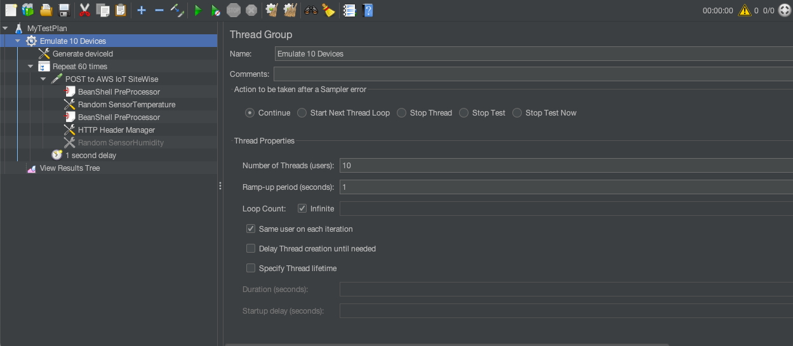
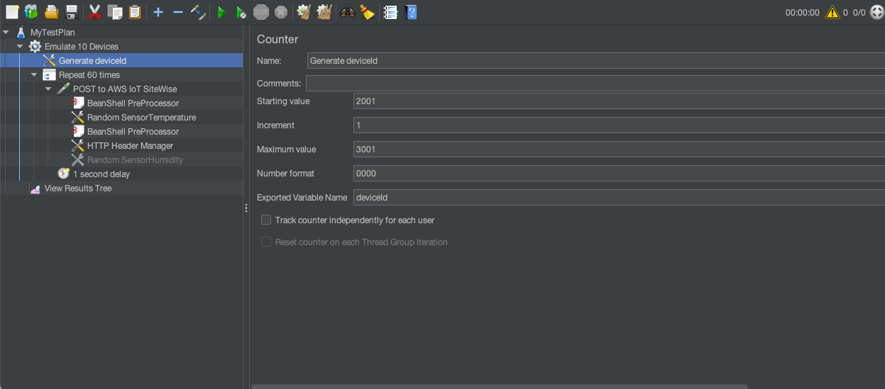
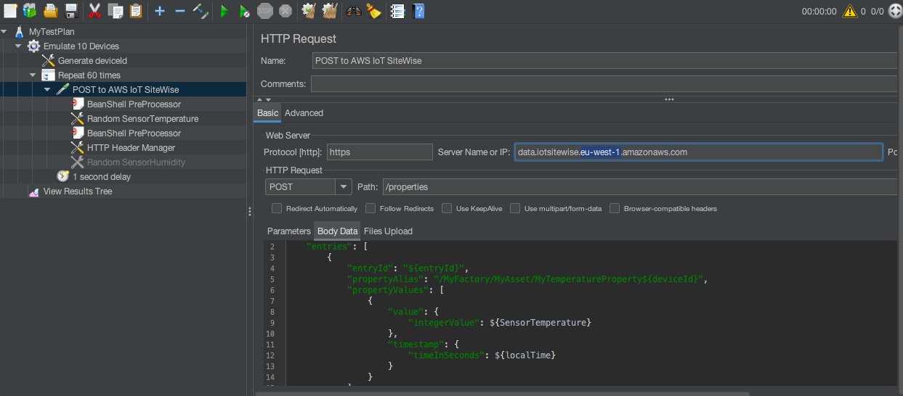
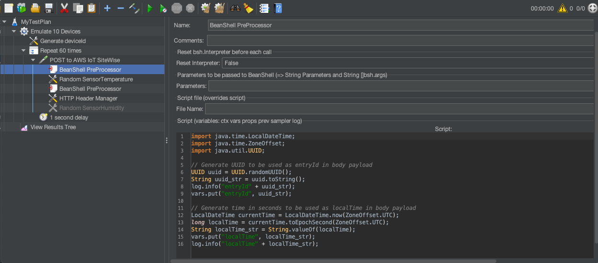
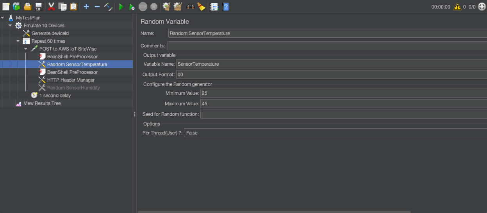
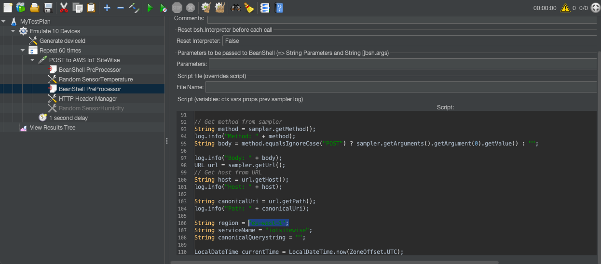
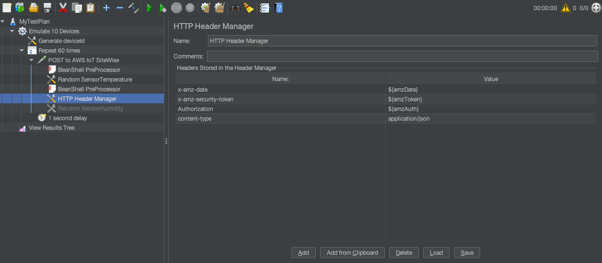
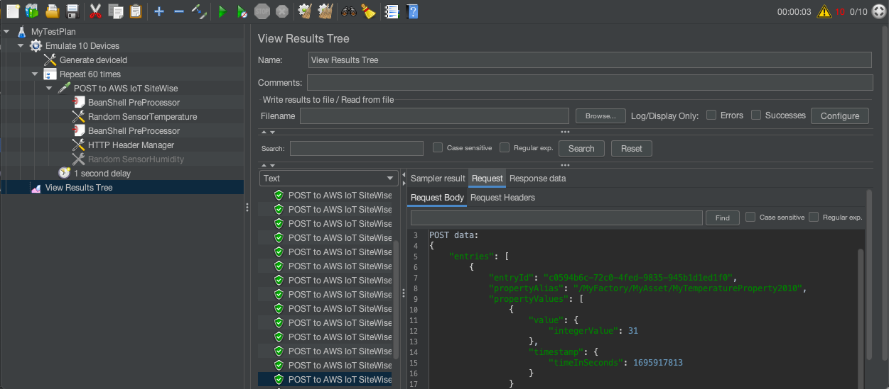
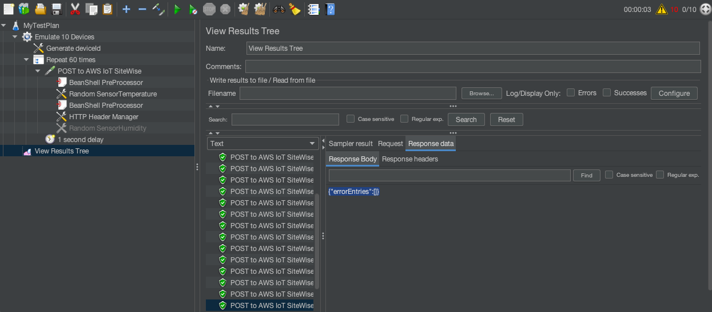

# Welcome to `aws-iot-sitewise-jmeter-java `

In this repo you will find two ways of interacting with the AWS IoT SiteWise endpoint that is normally used to ingest data: `BatchPutAssetPropertyValue`.  

The first one is a Java program that uses standard libraires to build the Sigv4 authentication header and make an HTTP POST request.

The second one is a similar program, also written in Java but integrated in the form of a script with JMeter – a commonly used tool to emulate Web traffic.


### Step 1 - AWS Credentials

Set your temporary AWS credentials. Make sure your policy allows you to do `iotsitewise:BatchPutAssetPropertyValue`.

```bash

export AWS_ACCESS_KEY_ID=ASIAYLEXAMPLE
export AWS_SECRET_ACCESS_KEY=KCF0pkigNXke/M7yhEXAMPLE
export AWS_SESSION_TOKEN=IQoJb3JpZ2luX2VjELD/EXAMPLEHKyOaXM3Of/19ZsiqH8ri86tU=

```
### Step 2 - Download the project 

```bash

git clone https://github.com/aws-samples/aws-iot-sitewise-jmeter

cd aws-iot-sitewise-jmeter

```
### Step 3 - Try out sending messages to AWS IoT SiteWise using native Java libraries

``` bash

# Build the project
mvn clean package

# Set the classpath to include org/apache/httpcomponents/httpclient, commons-logging and the project JAR
CLASSPATH=target/site-wise-sigv4-test-1.0-SNAPSHOT.jar
CLASSPATH=$CLASSPATH:~/.m2/repository/org/apache/httpcomponents//httpclient/4.5.13/httpclient-4.5.13.jar
CLASSPATH=$CLASSPATH:~/.m2/repository/org/apache/httpcomponents//httpcore/4.4.13/httpcore-4.4.13.jar
CLASSPATH=$CLASSPATH:~/.m2/repository//commons-logging/commons-logging/1.2/commons-logging-1.2.jar

# Inspect "SiteWiseEntries.json" under /extra and run program
java -cp $CLASSPATH com.amazon.SiteWiseSigV4Test.App extra/SiteWiseEntries.json

#
# -H "Authorization: AWS4-HM...64660fc47"
# -H "x-amz-date: 202...110Z"
# -H "x-amz-security-token: IQoJ...m8A="
# sendSigV4Post result: {"errorEntries":[]}
#

```

### Step 4 - Launch JMeter and run demo TestPlan

``` bash

jmeter  site-wise-sigv4-test-jmeter/testplan/SiteWiseEntries.jmx

```



<sub><sup>Figure 1. Test plan configured to emulate 10 devices, 1 message every 60 seconds for each one.</sup></sub>



<sub><sup>Figure 2. A sequential deviceId is generate for each device. This is used to build the PropertyAlias for the SiteWise entry.</sup></sub>


<sub><sup>Figure 3. Template used for the test. Note the 4 placeholders: `entityId` , `deviceId`, `SensorTemperature` and `localTime`</sup></sub>


<sub><sup>Figure 4. Beanshell script used to create `entryId` and `localTime` values</sup></sub>


<sub><sup>Figure 5. JMeter config element to generate a random value for `SensorTemperatrue`</sup></sub>


<sub><sup>Figure 6. Beanshell script that analyses the payload, takes AWS temporary credentials and produces `Authorization` `x-amz-date`. It also passes `AWS_SESSION_TOKEN` as `x-amz-security-token`</sup></sub>


<sub><sup>Figure 7. The header manager takes variables and sets them as HTTP headers</sup></sub>



<sub><sup>Figure 8. After running the test. You can see the results under "View Results Tree"</sup></sub>


<sub><sup>Figure 9. You can take a look at the "Response Data" to ensure you are getting the expected result from AWS IoT SiteWise</sup></sub>

Thats it! 